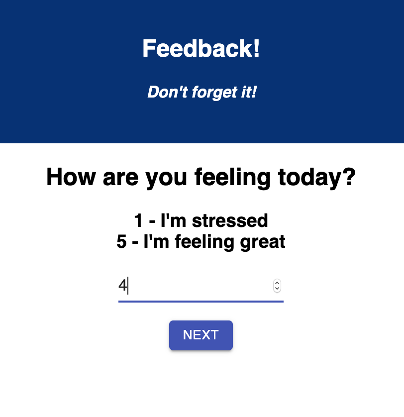
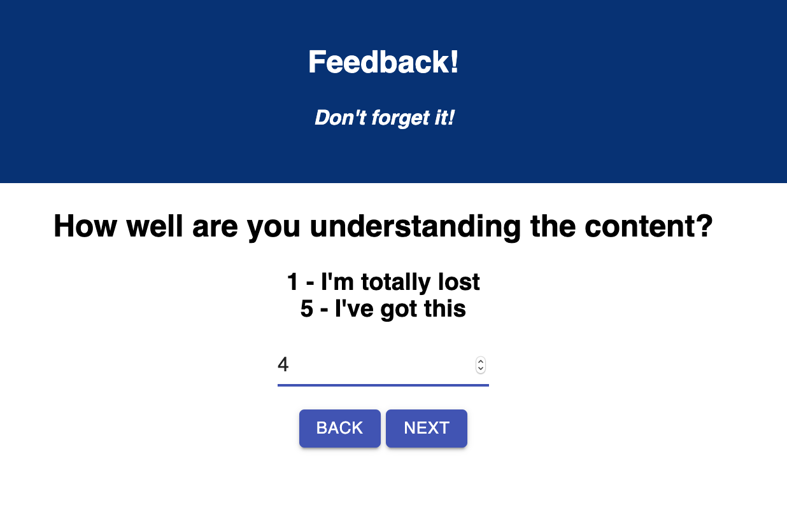
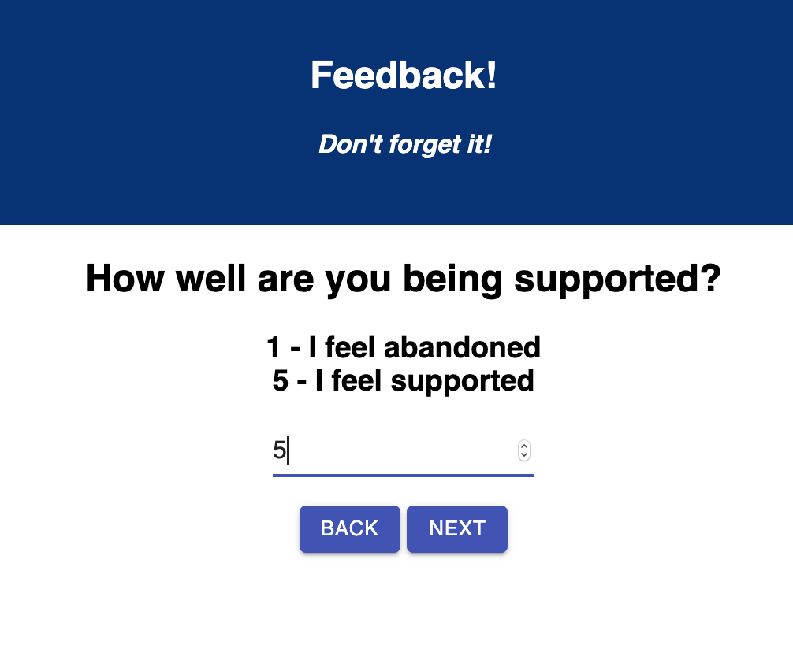
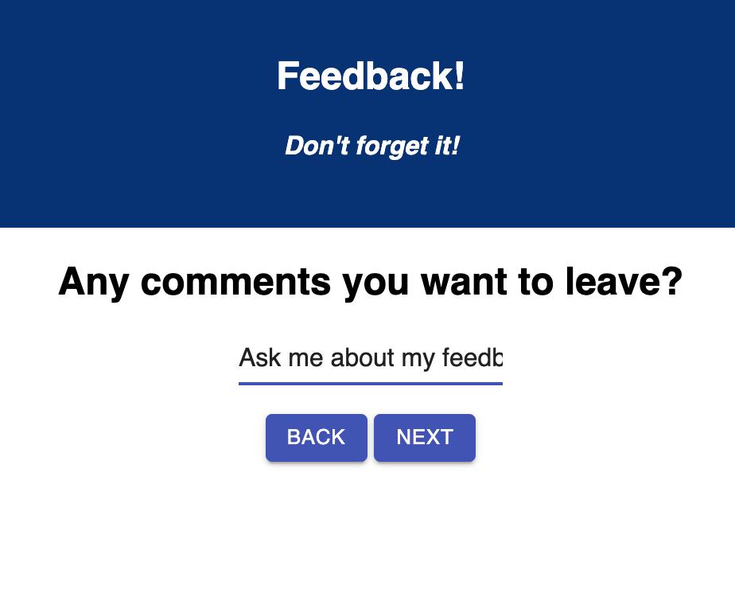
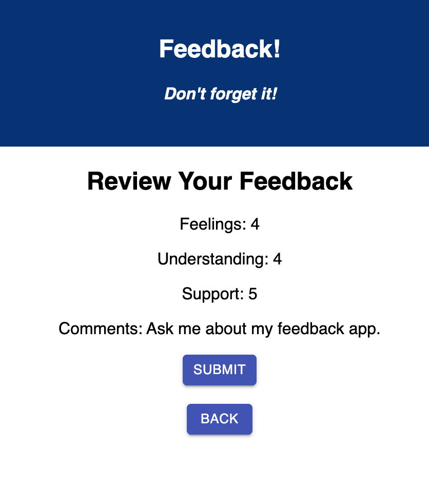
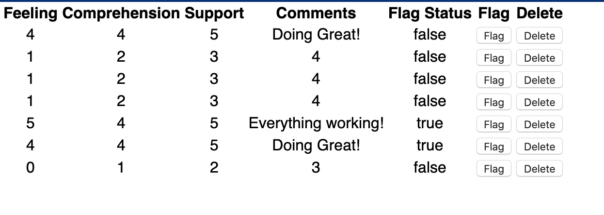

# Feedback Form with Redux 

## Description

Duration: 2 Days

What problem did you solve? How did you solve it?
While learning react-redux, I was able to create an application that takes in a user's response and set it in a database as well as get that data and store it within a reducer. Users are also able to view and go back to edit their feedback before they submit it to the database. There is also an admin page where admins can delete and flag different feedback submissions.
<!-- To see the fully functional site, please visit: DEPLOYED VERSION OF APP -->

## Wireframe

### Prerequisites

https://nodejs.org/en/

## Installation
This is a step by step list for how another developer could get this project up and running.

1. Create a database named prime_feedback
2. The queries in the tables.sql file are set up to create all the necessary tables and populate the needed data to allow the application to run correctly. The project is built on Postgres, so you will need to make sure to have that installed. I recommend using Postico to run those queries as that was used to create the queries.
3. Open up your editor of choice and run an npm install
4. Run npm run server in your terminal
5. Run npm run client in your terminal
6. The npm run client command will open up a new browser tab for you!

## Usage
You can use this applicaiton to add a feedback feature to any pre-existing applications.

## Built With
* SERN Stack
    * SQL
    * Express
    * React
    * Redux
    * Node
    * Material UI
    * Postgres
    * Postico

## Acknowledgement
Thanks to Prime Digital Academy in Minneapolis who equipped and helped me to make this application a reality.

## Support
If you have suggestions or issues, please email me at harrisonnguyen517@gmail.com
